## 信息发布使用说明

### 一：摘要说明
>我们是基于网络的编辑管理软件系统，是一套专门用于对各种电子信息进行编辑、网络发布和远程控制管理的综合信息显示系统平台，利用该平台可以对文字、图像、视频、外部动态数据等信息素材进行编辑制作，通过局域网统一管理控制、发布显示等

### 二：产品功能

*    设备终端支持远程监控在线状态，**重启、休眠、关机、唤醒、音量**

*    设备终端支持**离线、在线**两种模式
    
*    素材上传支持**视频、音频、图片、文档（ppt、excel、word）**

*    素材上传支持多个同时上传，支持预览

*    节目制作支持**各种不同分辨率**终端，根据终端分辨率制作节目
    
*    节目制作支持划分多区域，每个区域大小位置，自由划分，灵活掌控
   
*    节目制作每个区域可上传多个素材，各种轮播显示

*    节目制作内容支持**图片、文档、视频、时间、文本、内嵌HTML、背景图片、背景音乐**等

*    即时**发布紧急公告信息、突发事件公告**,**可插播到任一节目**，支持设定指定时间播放
       
*    节目发布可通过节目选择设备或者设备选择节目，发布播放
 
### 三：使用说明

### 3.1 首页
#### 3.1.1  在线监控在线设备、离线设备数量
#### 3.1.2  定时查看服务器安装盘空间
#### 3.1.3  建议操作流程图   
 
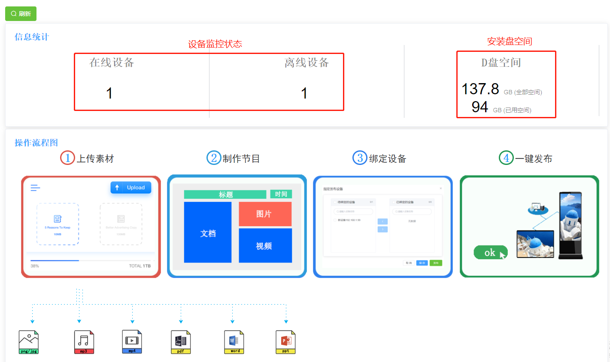  

### 3.2 设备管理
#### 3.2.1  选择需要操作的终端设备，**重启、休眠、关机、唤醒**等，可批量操作
#### 3.2.2  终端设备操作 **绑定、发布、修改、删除**  

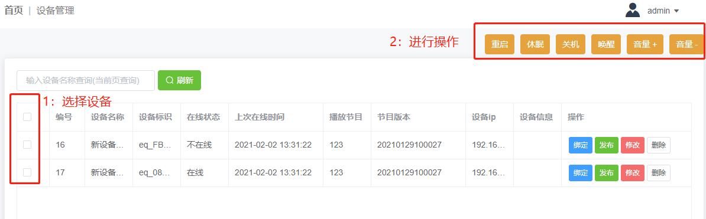   

#### 3.2.3  点击**绑定**，设备选择播放的节目
- 一个终端设备绑定一个普通节目	
- 一个终端设备绑定多个公告节目  

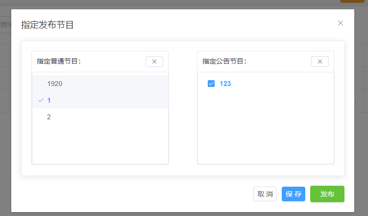  

#### 3.2.4  点击**发布**，通过终端设备加载播放最新节目

### 3.3 素材管理
#### 3.3.1 素材可根据类型查询
#### 3.3.2 素材可点击预览获取双击节目内容预览  

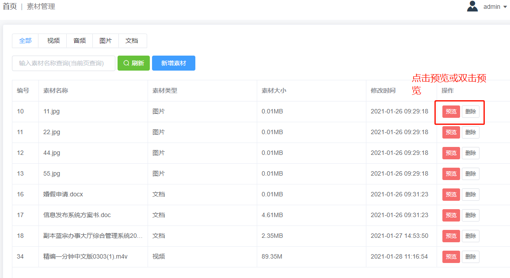  

#### 3.3.3 新增素材支持**视频、音频、图片、文档（ppt、excel、word）**  

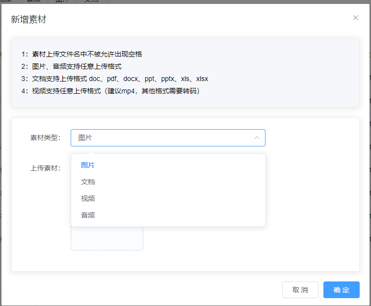

### 3.4 节目管理
#### 3.4.1 节目新增分为**普通节目和公告节目**
#### 3.4.2 终端设备操作 **绑定、发布、导出、修改、删除**  

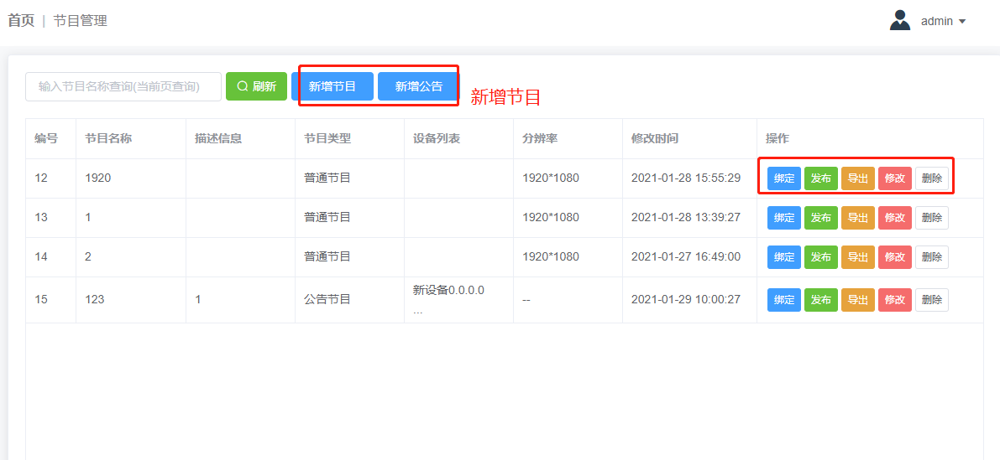  

#### 3.4.3 点击**绑定**，进行设备绑定
- 普通节目绑定设备，如果设备被其他节目绑定，设备不可以再次搬定。可接触绑定关系后，重新绑定
- 公告节目绑定设备没有限制  

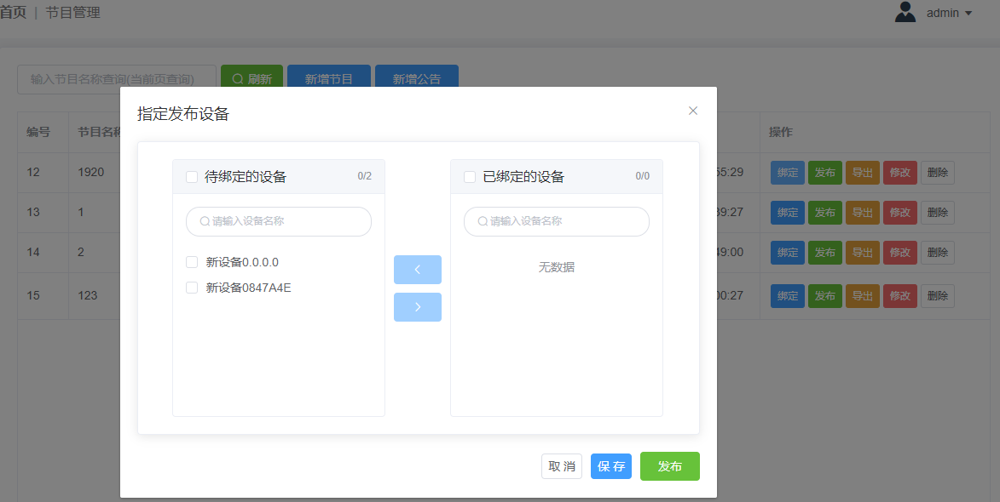  

#### 3.4.4 添加节目，可根据终端分辨率来制作节目  

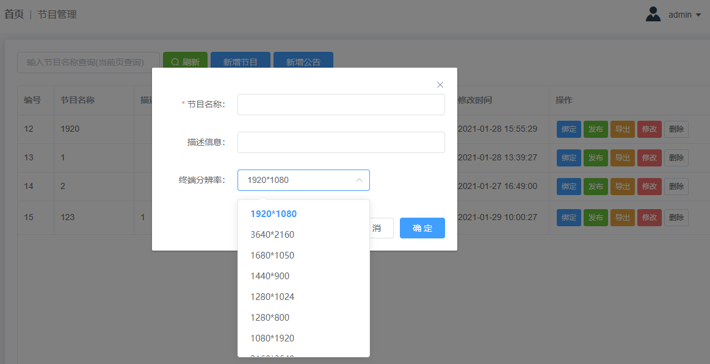

#### 3.4.5 节目制作多区域。多素材，灵活支配，灵活布局  

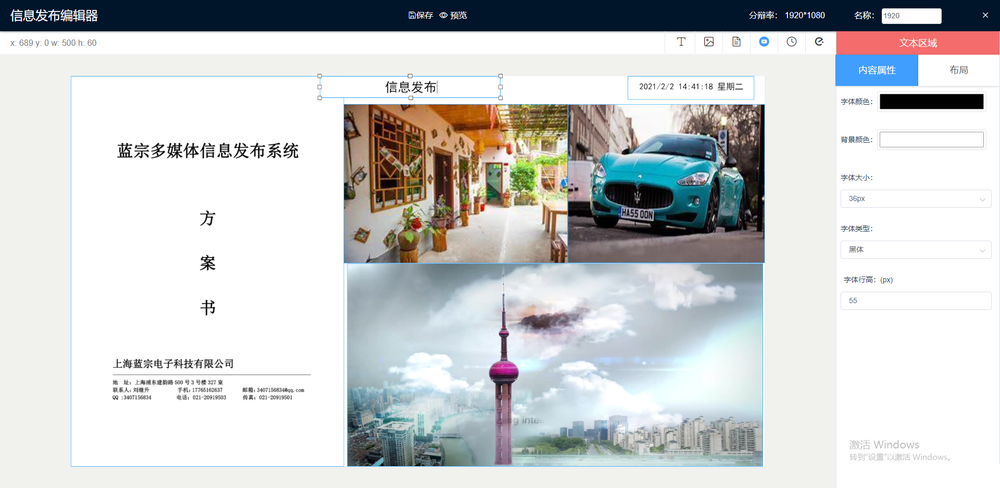

#### 3.4.6 添加区域素材的时候支持上传没有的素材   

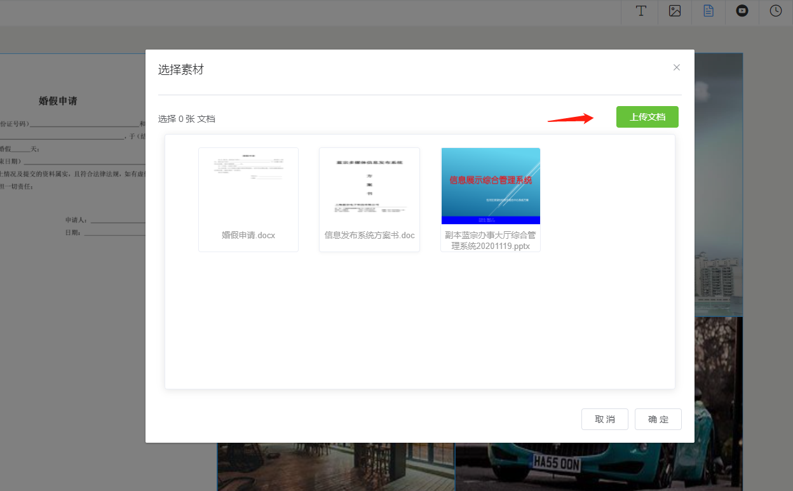

#### 3.4.7 不同区域有不同的属性配置，属性修改实时更新效果
#### 3.4.8 节目制作完可直接预览效果，预览效果同实际播放效果  

#### 3.4.9  添加公告支持全屏显示，支持置顶显示  

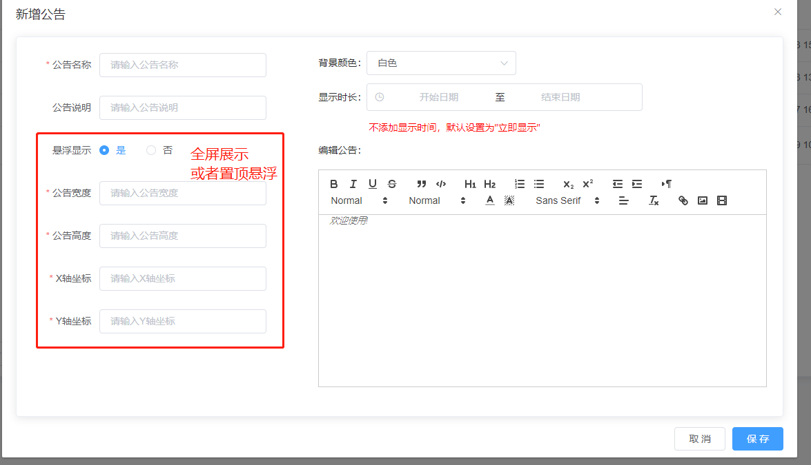

#### 3.4.10  添加公告支持定义播放开始时间、结束时间

### 3.5 用户管理
#### 3.5.1 用户的增删改查操作，目前账号都拥有管理员权限

